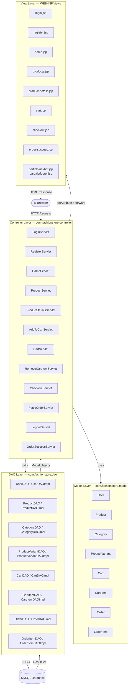
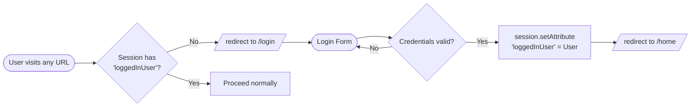

# Architecture — Fashion Store

## Tech Stack

| Layer | Technology |
|---|---|
| Language | Java 11 |
| Web Framework | Jakarta Servlet 5.0 + JSP |
| Build Tool | Maven |
| Database | MySQL |
| Server | Apache Tomcat |
| Frontend | HTML, CSS (Vanilla), JSP EL |

---

## MVC Pattern Overview



---

## Project Directory Structure

```
fashion-store/
├── src/main/
│   ├── java/com/fashionstore/
│   │   ├── controller/         ← 12 Servlets (Controllers)
│   │   ├── dao/                ← 8 DAO interfaces
│   │   │   └── impl/           ← 8 DAO implementations
│   │   ├── model/              ← 8 POJO model classes
│   │   └── util/
│   │       ├── DBConnection.java
│   │       └── AppInitializer.java
│   └── webapp/
│       ├── assets/
│       │   └── css/            ← style.css, home.css, products.css …
│       ├── WEB-INF/
│       │   ├── views/          ← 8 JSP pages + partials/
│       │   └── web.xml         ← DB credentials (not in Git)
│       └── index.jsp           ← Redirects to /login
├── docs/                       ← This documentation
└── pom.xml
```

---

## URL Routing Map

All routing is done via `@WebServlet` annotations — no `web.xml` servlet mappings needed.

| URL Pattern | Servlet | Method | Description |
|---|---|---|---|
| `/` | index.jsp | — | Redirects → `/login` |
| `/login` | LoginServlet | GET | Show login form |
| `/login` | LoginServlet | POST | Authenticate user |
| `/register` | RegisterServlet | GET | Show register form |
| `/register` | RegisterServlet | POST | Create new user |
| `/logout` | LogoutServlet | GET | Invalidate session |
| `/home` | HomeServlet | GET | Home page (auth required) |
| `/products` | ProductServlet | GET | Product listing + filter |
| `/product-details` | ProductDetailsServlet | GET | Single product view |
| `/add-to-cart` | AddToCartServlet | POST | Add item to cart |
| `/cart` | CartServlet | GET | View cart (auth required) |
| `/remove-cart-item` | RemoveCartItemServlet | GET | Remove cart item |
| `/checkout` | CheckoutServlet | GET | Checkout page (auth required) |
| `/place-order` | PlaceOrderServlet | POST | Create order, clear cart |
| `/order-success` | OrderSuccessServlet | GET | Success confirmation |

---

## Session & Authentication



**Protected routes** (redirect to `/login` if no session):
- `HomeServlet`, `CartServlet`, `CheckoutServlet`, `AddToCartServlet`, `PlaceOrderServlet`

---

## DB Credential Configuration

Credentials are **not hardcoded**. They are loaded from `web.xml` context params at startup by `AppInitializer.java` (a `ServletContextListener`), and stored statically in `DBConnection.java`.

```
web.xml  →  AppInitializer (on startup)  →  DBConnection.setCredentials()  →  DAO classes
```
