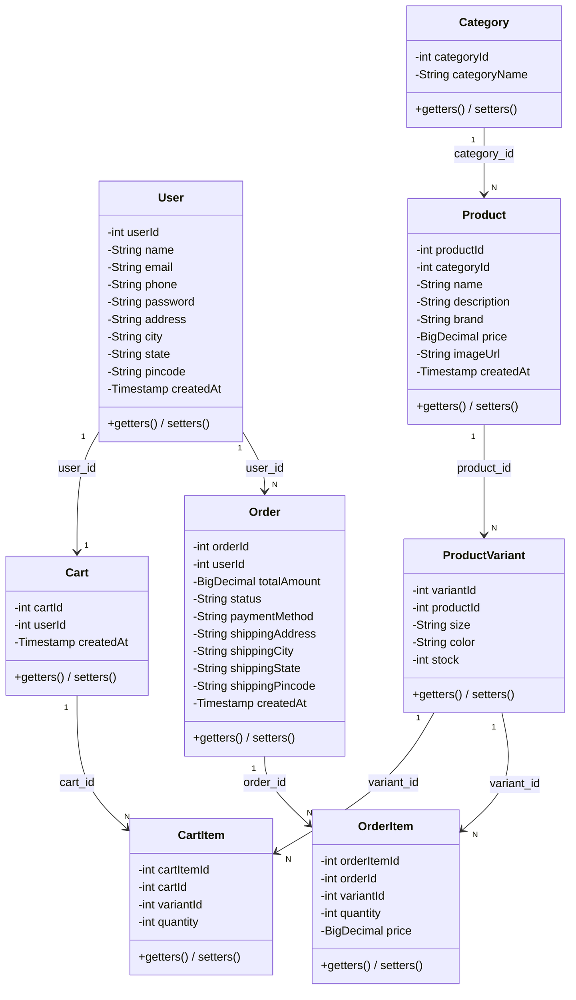

# Class Diagrams — Fashion Store

## Model Classes

```mermaid
classDiagram
    class User {
        -int userId
        -String name
        -String email
        -String phone
        -String password
        -String address
        -String city
        -String state
        -String pincode
        -Timestamp createdAt
        +getters() / setters()
    }

    class Category {
        -int categoryId
        -String categoryName
        +getters() / setters()
    }

    class Product {
        -int productId
        -int categoryId
        -String name
        -String description
        -String brand
        -BigDecimal price
        -String imageUrl
        -Timestamp createdAt
        +getters() / setters()
    }

    class ProductVariant {
        -int variantId
        -int productId
        -String size
        -String color
        -int stock
        +getters() / setters()
    }

    class Cart {
        -int cartId
        -int userId
        -Timestamp createdAt
        +getters() / setters()
    }

    class CartItem {
        -int cartItemId
        -int cartId
        -int variantId
        -int quantity
        +getters() / setters()
    }

    class Order {
        -int orderId
        -int userId
        -BigDecimal totalAmount
        -String status
        -String paymentMethod
        -String shippingAddress
        -String shippingCity
        -String shippingState
        -String shippingPincode
        -Timestamp createdAt
        +getters() / setters()
    }

    class OrderItem {
        -int orderItemId
        -int orderId
        -int variantId
        -int quantity
        -BigDecimal price
        +getters() / setters()
    }

    Category "1" --> "N" Product : category_id
    Product "1" --> "N" ProductVariant : product_id
    User "1" --> "1" Cart : user_id
    Cart "1" --> "N" CartItem : cart_id
    ProductVariant "1" --> "N" CartItem : variant_id
    User "1" --> "N" Order : user_id
    Order "1" --> "N" OrderItem : order_id
    ProductVariant "1" --> "N" OrderItem : variant_id
```

---

## DAO Interface & Implementation Classes

```mermaid
classDiagram
    class UserDAO {
        <<interface>>
        +registerUser(User) boolean
        +loginUser(String email, String password) User
        +emailExists(String email) boolean
        +phoneExists(String phone) boolean
    }
    class UserDAOImpl {
        +registerUser(User) boolean
        +loginUser(String, String) User
        +emailExists(String) boolean
        +phoneExists(String) boolean
    }
    UserDAO <|.. UserDAOImpl

    class ProductDAO {
        <<interface>>
        +getAllProducts() List~Product~
        +getProductById(int) Product
        +getProductsByCategory(int) List~Product~
        +searchProducts(String) List~Product~
        +getLatestProducts() List~Product~
        +sortProductsByPriceLowToHigh() List~Product~
        +sortProductsByPriceHighToLow() List~Product~
    }
    class ProductDAOImpl {
        +getAllProducts() List~Product~
        +getProductById(int) Product
        +getProductsByCategory(int) List~Product~
        +searchProducts(String) List~Product~
        +getLatestProducts() List~Product~
    }
    ProductDAO <|.. ProductDAOImpl

    class CategoryDAO {
        <<interface>>
        +getAllCategories() List~Category~
        +getCategoryById(int) Category
        +getCategoryByName(String) Category
        +addCategory(Category) boolean
        +updateCategory(Category) boolean
        +deleteCategory(int) boolean
    }
    class CategoryDAOImpl {
        +getAllCategories() List~Category~
        +getCategoryById(int) Category
        +getCategoryByName(String) Category
    }
    CategoryDAO <|.. CategoryDAOImpl

    class ProductVariantDAO {
        <<interface>>
        +getVariantsByProductId(int) List~ProductVariant~
        +getVariantById(int) ProductVariant
    }
    class ProductVariantDAOImpl
    ProductVariantDAO <|.. ProductVariantDAOImpl

    class CartDAO {
        <<interface>>
        +getCartByUserId(int) Cart
        +createCart(Cart) boolean
    }
    class CartDAOImpl
    CartDAO <|.. CartDAOImpl

    class CartItemDAO {
        <<interface>>
        +addCartItem(CartItem) boolean
        +getCartItemsByCartId(int) List~CartItem~
        +getCartItemByCartAndVariant(int cartId, int variantId) CartItem
        +updateCartItem(CartItem) boolean
        +removeCartItem(int) boolean
        +clearCartItems(int cartId) boolean
        +getCartTotal(int cartId) BigDecimal
    }
    class CartItemDAOImpl
    CartItemDAO <|.. CartItemDAOImpl

    class OrderDAO {
        <<interface>>
        +placeOrder(Order) int
    }
    class OrderDAOImpl
    OrderDAO <|.. OrderDAOImpl

    class OrderItemDAO {
        <<interface>>
        +addOrderItems(List~OrderItem~) boolean
    }
    class OrderItemDAOImpl
    OrderDAO <|.. OrderDAOImpl
    OrderItemDAO <|.. OrderItemDAOImpl
```

---

## Controller → DAO Dependencies

```mermaid
classDiagram
    class LoginServlet {
        -UserDAO userDAO
        +doGet()
        +doPost()
    }
    LoginServlet --> UserDAO

    class RegisterServlet {
        -UserDAO userDAO
        +doGet()
        +doPost()
    }
    RegisterServlet --> UserDAO

    class HomeServlet {
        -ProductDAO productDAO
        -CategoryDAO categoryDAO
        +doGet()
    }
    HomeServlet --> ProductDAO
    HomeServlet --> CategoryDAO

    class ProductServlet {
        -ProductDAO productDAO
        -CategoryDAO categoryDAO
        +doGet()
    }
    ProductServlet --> ProductDAO
    ProductServlet --> CategoryDAO

    class ProductDetailsServlet {
        -ProductDAO productDAO
        -ProductVariantDAO productVariantDAO
        +doGet()
    }
    ProductDetailsServlet --> ProductDAO
    ProductDetailsServlet --> ProductVariantDAO

    class AddToCartServlet {
        -CartDAO cartDAO
        -CartItemDAO cartItemDAO
        +doPost()
    }
    AddToCartServlet --> CartDAO
    AddToCartServlet --> CartItemDAO

    class CartServlet {
        -CartDAO cartDAO
        -CartItemDAO cartItemDAO
        +doGet()
    }
    CartServlet --> CartDAO
    CartServlet --> CartItemDAO

    class CheckoutServlet {
        -CartDAO cartDAO
        -CartItemDAO cartItemDAO
        +doGet()
    }
    CheckoutServlet --> CartDAO
    CheckoutServlet --> CartItemDAO

    class PlaceOrderServlet {
        -CartDAO cartDAO
        -CartItemDAO cartItemDAO
        -OrderDAO orderDAO
        -OrderItemDAO orderItemDAO
        -ProductDAO productDAO
        -ProductVariantDAO productVariantDAO
        +doPost()
    }
    PlaceOrderServlet --> CartDAO
    PlaceOrderServlet --> CartItemDAO
    PlaceOrderServlet --> OrderDAO
    PlaceOrderServlet --> OrderItemDAO
    PlaceOrderServlet --> ProductDAO
    PlaceOrderServlet --> ProductVariantDAO

    class RemoveCartItemServlet {
        -CartItemDAO cartItemDAO
        +doGet()
    }
    RemoveCartItemServlet --> CartItemDAO
```
