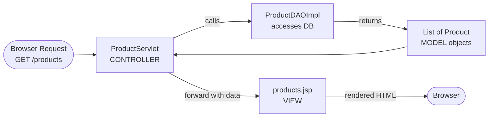
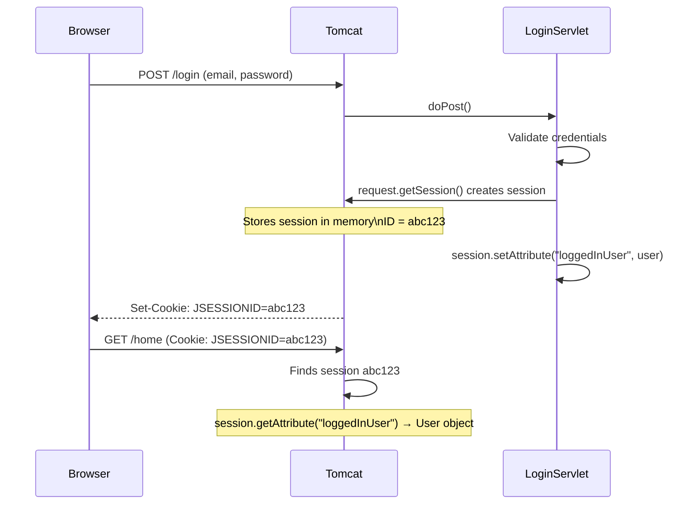

# Concepts Explained — Fashion Store

A practical guide to every technology and pattern used in this project. Each section explains **what** it is, **why** we need it, and **how/where** it's used in Fashion Store.

---

## 1. MVC Pattern (Model-View-Controller)

### What is MVC?
MVC is a design pattern that separates an application into three components:

| Component | Role | In this project |
|---|---|---|
| **Model** | Holds data (Java objects) | `model/` package — `User.java`, `Product.java`, etc. |
| **View** | Displays data to the user (UI) | JSP files in `WEB-INF/views/` |
| **Controller** | Handles requests, calls business logic, decides which view to show | Servlets in `controller/` package |

### Why do we need MVC?
Without MVC, your database code, business logic, and HTML would all be in the same file — a mess to maintain. MVC gives you:
- **Single responsibility** — each file does one thing
- **Easy debugging** — if a product isn't showing, you know to check the controller or DAO, not the JSP
- **Team collaboration** — a frontend dev works on JSP, a backend dev works on servlets

### How does MVC work in Fashion Store?



**Example — Viewing the products page:**

1. You type `localhost:8080/fashion-store/products` in the browser
2. Tomcat sees `/products` and routes it to `ProductServlet` (because of `@WebServlet("/products")`)
3. `ProductServlet.doGet()` runs:
   - Calls `categoryDAO.getAllCategories()` → gets categories from DB
   - Calls `productDAO.getAllProducts()` → gets products from DB
   - Sets both as request attributes: `request.setAttribute("products", products)`
   - Forwards to `products.jsp`: `request.getRequestDispatcher("/WEB-INF/views/products.jsp").forward(request, response)`
4. `products.jsp` reads the attributes and generates HTML with a for-loop over the products
5. Browser receives and renders the HTML

---

## 2. DAO Pattern (Data Access Object)

### What is DAO?
DAO is a design pattern where **all database operations are isolated in separate classes**. Instead of writing SQL queries inside your servlet, you create:
- A **DAO interface** — defines what operations are available (e.g., `getAllProducts()`)
- A **DAO implementation** — contains the actual SQL queries and JDBC code

### Why do we need DAO?
Imagine you have SQL queries scattered across 12 servlets. If you change your database from MySQL to PostgreSQL, you'd have to edit all 12 files. With DAO:
- **Change one file** (the implementation), all servlets keep working
- **Easier testing** — you can create a mock DAO for testing without a real database
- **No duplicate code** — `getProductById()` is written once, used by multiple servlets

### How DAO is structured in Fashion Store

```
dao/
├── ProductDAO.java           ← Interface (contract)
│   └── impl/
│       └── ProductDAOImpl.java  ← Implementation (actual SQL)
```

**Interface** (what methods exist):
```java
public interface ProductDAO {
    List<Product> getAllProducts();
    Product getProductById(int id);
    List<Product> getProductsByCategory(int categoryId);
    List<Product> searchProducts(String keyword);
    List<Product> getLatestProducts();
}
```

**Implementation** (how they work):
```java
public class ProductDAOImpl implements ProductDAO {
    @Override
    public List<Product> getAllProducts() {
        String query = "SELECT * FROM products";
        // Execute query via JDBC, map ResultSet to Product objects
        return products;
    }
}
```

**Servlet uses the interface** (doesn't care about implementation):
```java
private ProductDAO productDAO = new ProductDAOImpl();
List<Product> products = productDAO.getAllProducts();
```

### All 8 DAO pairs in this project

| DAO Interface | Implementation | Table | Used By |
|---|---|---|---|
| `UserDAO` | `UserDAOImpl` | `users` | LoginServlet, RegisterServlet |
| `CategoryDAO` | `CategoryDAOImpl` | `categories` | HomeServlet, ProductServlet |
| `ProductDAO` | `ProductDAOImpl` | `products` | HomeServlet, ProductServlet, ProductDetailsServlet, PlaceOrderServlet |
| `ProductVariantDAO` | `ProductVariantDAOImpl` | `product_variants` | ProductDetailsServlet, PlaceOrderServlet |
| `CartDAO` | `CartDAOImpl` | `carts` | CartServlet, AddToCartServlet, CheckoutServlet, PlaceOrderServlet |
| `CartItemDAO` | `CartItemDAOImpl` | `cart_items` | CartServlet, AddToCartServlet, RemoveCartItemServlet, CheckoutServlet, PlaceOrderServlet |
| `OrderDAO` | `OrderDAOImpl` | `orders` | PlaceOrderServlet |
| `OrderItemDAO` | `OrderItemDAOImpl` | `order_items` | PlaceOrderServlet |

---

## 3. Servlets (Jakarta Servlets)

### What is a Servlet?
A Servlet is a **Java class that handles HTTP requests** (GET, POST) and sends back HTTP responses. It's the backbone of Java web applications — every URL in your app is handled by a servlet.

### Why do we need Servlets?
Without servlets, Java has no way to handle web requests. Servlets provide:
- **URL mapping** — each URL pattern is handled by a specific servlet
- **Request parsing** — read form data, query parameters, headers
- **Session management** — track logged-in users across requests
- **Response control** — redirect, forward, send errors

### How Servlets work in Fashion Store

Every servlet in this project:
1. Is annotated with `@WebServlet("/url-pattern")` — this tells Tomcat which URL it handles
2. Extends `HttpServlet` — the base class for all servlets
3. Overrides `doGet()` for GET requests (viewing pages) and/or `doPost()` for POST requests (form submissions)
4. Uses `init()` to set up DAO instances once when the servlet loads

**Example — LoginServlet:**

```java
@WebServlet("/login")                               // 1. URL = /login
public class LoginServlet extends HttpServlet {      // 2. Extends HttpServlet

    private UserDAO userDAO;

    @Override
    public void init() {                             // 4. Setup DAOs
        userDAO = new UserDAOImpl();
    }

    @Override
    protected void doGet(...) {                      // 3a. GET = show login page
        request.getRequestDispatcher("/WEB-INF/views/login.jsp")
               .forward(request, response);
    }

    @Override
    protected void doPost(...) {                     // 3b. POST = handle login form
        String email = request.getParameter("email");
        String password = request.getParameter("password");
        User user = userDAO.loginUser(email, password);

        if (user != null) {
            HttpSession session = request.getSession();
            session.setAttribute("loggedInUser", user);  // Save user in session
            response.sendRedirect("/home");               // Go to home
        } else {
            request.setAttribute("errorMessage", "Invalid credentials");
            request.getRequestDispatcher("/WEB-INF/views/login.jsp")
                   .forward(request, response);           // Show error
        }
    }
}
```

### All 12 Servlets in this project

| Servlet | URL | HTTP Method | What it does |
|---|---|---|---|
| `LoginServlet` | `/login` | GET + POST | Show login form / authenticate user |
| `RegisterServlet` | `/register` | GET + POST | Show register form / create user |
| `LogoutServlet` | `/logout` | GET | Destroy session, redirect to login |
| `HomeServlet` | `/home` | GET | Fetch categories + latest products, show home |
| `ProductServlet` | `/products` | GET | Fetch filtered/sorted products, show listing |
| `ProductDetailsServlet` | `/product-details` | GET | Fetch single product + variants, show detail |
| `AddToCartServlet` | `/add-to-cart` | POST | Add a variant to user's cart |
| `CartServlet` | `/cart` | GET | Show cart items + total |
| `RemoveCartItemServlet` | `/remove-cart-item` | GET | Remove item from cart |
| `CheckoutServlet` | `/checkout` | GET | Show checkout form with cart summary |
| `PlaceOrderServlet` | `/place-order` | POST | Create order from cart, clear cart |
| `OrderSuccessServlet` | `/order-success` | GET | Show success page |

---

## 4. JSP (JavaServer Pages)

### What is JSP?
JSP is a technology that lets you **embed Java code inside HTML**. The server processes the Java code and sends pure HTML to the browser. The browser never sees Java — only the generated HTML.

### Why do we need JSP?
Without JSP, you'd have to write HTML strings inside Java code using `response.getWriter().println("<h1>Hello</h1>")` — extremely painful for complex pages. JSP lets you write normal HTML and insert dynamic data where needed.

### How JSP works

```
Server side:                        Browser receives:
┌─────────────────────┐            ┌──────────────────────┐
│ <h1>Hello,          │            │ <h1>Hello,           │
│   <%= user.getName()│   ──────►  │   Dharshan           │
│ %></h1>             │            │ </h1>                │
└─────────────────────┘            └──────────────────────┘
```

### JSP Syntax used in this project

| Syntax | Purpose | Example |
|---|---|---|
| `<% ... %>` | Execute Java code (scriptlet) | `<% if (user != null) { %>` |
| `<%= ... %>` | Output a value | `<%= product.getName() %>` |
| `<%@ page import="..." %>` | Import Java classes | `<%@ page import="java.util.List" %>` |
| `${pageContext.request.contextPath}` | Get app base URL (EL expression) | `href="${pageContext.request.contextPath}/home"` |
| `<jsp:include page="..." />` | Include another JSP file | `<jsp:include page="partials/navbar.jsp" />` |

### Where JSP is used in Fashion Store

All 8 view files are JSP pages stored in `WEB-INF/views/`:

| JSP File | Purpose | Data it receives from Servlet |
|---|---|---|
| `login.jsp` | Login form | `errorMessage` (optional) |
| `register.jsp` | Registration form | `errorMessage` (optional) |
| `home.jsp` | Home page | `latestProducts`, `categories` |
| `products.jsp` | Product listing | `products`, `categories`, `selectedCategory`, `selectedSort` |
| `product-details.jsp` | Single product | `product`, `variants` |
| `cart.jsp` | Shopping cart | `cartItems`, `cartTotal` |
| `checkout.jsp` | Checkout form | `user`, `cartItems`, `cartTotal` |
| `order-success.jsp` | Confirmation | (none — static content) |

### Why are JSPs inside WEB-INF?
Files inside `WEB-INF/` **cannot be accessed directly by the browser**. A user cannot type `localhost:8080/WEB-INF/views/cart.jsp` and see it. They MUST go through a servlet, which checks authentication first. This is a **security pattern**.

---

## 5. JDBC (Java Database Connectivity)

### What is JDBC?
JDBC is Java's **standard API for connecting to relational databases**. It provides classes to:
- Open a connection to a database
- Send SQL queries (SELECT, INSERT, UPDATE, DELETE)
- Read results from the database
- Close the connection

### Why do we need JDBC?
Java doesn't know how to talk to MySQL, PostgreSQL, or any database by default. JDBC is the bridge. The **MySQL Connector/J** (a JAR dependency in `pom.xml`) implements the JDBC interface specifically for MySQL.

### How JDBC is used in Fashion Store

**Step 1: Connection setup** (in `DBConnection.java`):
```java
public class DBConnection {
    private static String url;       // e.g., jdbc:mysql://localhost:3306/fashion_store
    private static String username;  // e.g., root
    private static String password;  // e.g., *****

    public static Connection getConnection() throws Exception {
        Class.forName("com.mysql.cj.jdbc.Driver");  // Load MySQL driver
        return DriverManager.getConnection(url, username, password);
    }
}
```

**Step 2: Using JDBC in a DAO** (in `ProductDAOImpl.java`):
```java
public Product getProductById(int productId) {
    String query = "SELECT * FROM products WHERE product_id = ?";

    try (
        Connection conn = DBConnection.getConnection();          // 1. Get connection
        PreparedStatement stmt = conn.prepareStatement(query)    // 2. Prepare SQL
    ) {
        stmt.setInt(1, productId);                               // 3. Set parameter
        ResultSet rs = stmt.executeQuery();                      // 4. Execute query

        if (rs.next()) {                                         // 5. Read result
            Product product = new Product();
            product.setProductId(rs.getInt("product_id"));
            product.setName(rs.getString("name"));
            product.setPrice(rs.getBigDecimal("price"));
            // ... map all columns
            return product;
        }
    } catch (Exception e) {
        e.printStackTrace();
    }
    return null;
}
```

### Key JDBC concepts used

| Concept | What it does | Where |
|---|---|---|
| `DriverManager.getConnection()` | Opens a TCP connection to MySQL | `DBConnection.java` |
| `PreparedStatement` | Prevents SQL injection by using `?` placeholders | Every DAO implementation |
| `ResultSet` | Holds the rows returned by a SELECT query | Every DAO `get` / `search` method |
| `executeUpdate()` | For INSERT / UPDATE / DELETE (returns row count) | `registerUser()`, `addCartItem()`, etc. |
| `executeQuery()` | For SELECT (returns ResultSet) | `getAllProducts()`, `loginUser()`, etc. |
| `try-with-resources` | Auto-closes connections after use (prevents leaks) | Every DAO method |
| `getGeneratedKeys()` | Gets auto-increment ID after INSERT | `placeOrder()` to get new `order_id` |

---

## 6. Apache Tomcat

### What is Tomcat?
Apache Tomcat is a **web server and servlet container**. It:
- Listens for HTTP requests on a port (default: 8080)
- Routes URLs to the correct servlet based on `@WebServlet` annotations
- Manages the lifecycle of servlets (creating, initializing, destroying)
- Compiles JSP files into servlets at runtime
- Manages sessions (`HttpSession`)

### Why do we need Tomcat?
Java Servlets and JSP don't run on their own — they need a **container** to manage them. Tomcat is that container. Without Tomcat, your servlet code is just a Java class that can't receive web requests.

### How Tomcat is used in Fashion Store

```
You run Tomcat → Tomcat loads fashion-store.war → Your app is live at port 8080
```

1. **Maven builds** the project into a `.war` file: `mvn package` → `target/fashion-store.war`
2. The WAR is placed in Tomcat's `webapps/` directory
3. Tomcat auto-deploys it and makes it available at `http://localhost:8080/fashion-store`
4. When a request comes in for `/products`, Tomcat finds `ProductServlet` (annotated `@WebServlet("/products")`) and calls its `doGet()`

### Tomcat's role at runtime

| Tomcat does this | Your code does this |
|---|---|
| Receives HTTP request | — |
| Matches URL to Servlet | — |
| Creates `HttpServletRequest` and `HttpServletResponse` objects | — |
| Calls your `doGet()` or `doPost()` | Processes request, calls DAOs, sets attributes |
| — | Forwards to JSP |
| Compiles JSP to HTML | — |
| Sends HTML response to browser | — |
| Manages `HttpSession` objects | Reads/writes session attributes |

---

## 7. WAR Files (Web Application Archive)

### What is a WAR file?
A WAR file is a **packaged, deployable version of your web application**. It's a ZIP file with a specific structure:

```
fashion-store.war
├── WEB-INF/
│   ├── web.xml                  ← Deployment descriptor
│   ├── classes/                 ← Compiled .class files
│   │   └── com/fashionstore/    ← Your Java code (compiled)
│   └── lib/                     ← JAR dependencies (MySQL connector, etc.)
├── assets/                      ← CSS, images
└── index.jsp
```

### Why do we need WAR files?
- **Portable** — one file contains everything needed to run the app
- **Deployable** — drop it into Tomcat's `webapps/` and it auto-deploys
- **Versioned** — rename to `fashion-store-v2.war` to deploy a new version alongside the old one
- **Standard** — any Java servlet container (Tomcat, Jetty, WildFly) understands WAR files

### How the WAR is created
In `pom.xml`, the packaging is set to `war`:
```xml
<packaging>war</packaging>
```

Running `mvn clean package` compiles all Java code, copies all web resources, and produces `target/fashion-store.war`.

---

## 8. Maven (Apache Maven)

### What is Maven?
Maven is a **build tool** for Java projects. It handles:
- **Dependency management** — declare what JARs you need, Maven downloads them
- **Build lifecycle** — compile, test, package into WAR
- **Project structure** — enforces a standard directory layout

### Why do we need Maven?
Without Maven, you'd manually download JAR files, add them to a folder, and write complex build scripts. Maven automates all of this.

### How Maven is used — pom.xml

```xml
<dependencies>
    <!-- This tells Maven: "I need the Jakarta Servlet API" -->
    <dependency>
        <groupId>jakarta.servlet</groupId>
        <artifactId>jakarta.servlet-api</artifactId>
        <version>5.0.0</version>
        <scope>provided</scope>  <!-- Tomcat already has this, don't include in WAR -->
    </dependency>

    <!-- This tells Maven: "I need the MySQL JDBC driver" -->
    <dependency>
        <groupId>mysql</groupId>
        <artifactId>mysql-connector-java</artifactId>
        <version>8.0.33</version>
    </dependency>
</dependencies>
```

---

## 9. HttpSession (Session Management)

### What is HttpSession?
HTTP is **stateless** — the server forgets you after each request. Sessions solve this by storing user data on the server and linking it to the browser via a cookie (`JSESSIONID`).

### How sessions work in Fashion Store



### Where sessions are checked

```java
// This pattern appears in HomeServlet, CartServlet, CheckoutServlet, etc.
HttpSession session = request.getSession(false);    // false = don't create new
if (session == null || session.getAttribute("loggedInUser") == null) {
    response.sendRedirect(request.getContextPath() + "/login");
    return;  // Stop processing
}
```

---

## 10. web.xml (Deployment Descriptor)

### What is web.xml?
It's an XML configuration file that tells Tomcat about your application. In Fashion Store, it stores **database credentials** as context parameters:

```xml
<context-param>
    <param-name>DB_URL</param-name>
    <param-value>jdbc:mysql://localhost:3306/fashion_store</param-value>
</context-param>
<context-param>
    <param-name>DB_USERNAME</param-name>
    <param-value>root</param-value>
</context-param>
<context-param>
    <param-name>DB_PASSWORD</param-name>
    <param-value>your_password_here</param-value>
</context-param>
```

`AppInitializer.java` (a `ServletContextListener`) reads these at startup and passes them to `DBConnection.java`. This keeps credentials out of your Java source code and out of Git.

---

## 11. Request Forwarding vs Redirect

Both are used in this project for different purposes:

| Method | What happens | When to use | Example in project |
|---|---|---|---|
| `request.getRequestDispatcher(...).forward()` | Server internally sends request to JSP. URL in browser **doesn't change** | Showing a page with data | `ProductServlet` forwards to `products.jsp` |
| `response.sendRedirect(...)` | Server tells browser to make a **new request**. URL **changes** | After form submission (POST→GET pattern) | `LoginServlet` redirects to `/home` after login |

### Why use redirect after POST?
If a user submits a login form and you **forward** to the home page, pressing refresh would re-submit the form. By **redirecting**, the browser makes a fresh GET request — refreshing is safe.
