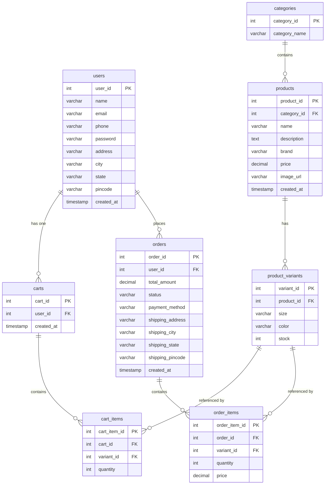
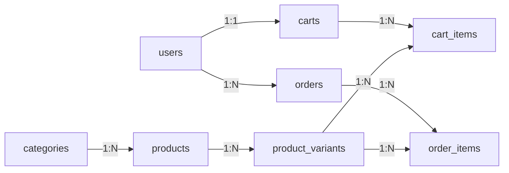

# Database Documentation — Fashion Store

## Tables Overview

| Table | Rows Represent | Java Model |
|---|---|---|
| `users` | Registered customers | `User.java` |
| `categories` | Product categories (Men, Women…) | `Category.java` |
| `products` | Fashion items for sale | `Product.java` |
| `product_variants` | Size/color combinations of a product | `ProductVariant.java` |
| `carts` | One cart per user | `Cart.java` |
| `cart_items` | Items inside a cart | `CartItem.java` |
| `orders` | Placed orders | `Order.java` |
| `order_items` | Line items inside an order | `OrderItem.java` |

---

## Entity-Relationship Diagram

---

## Table Relationships

| Relationship | Type | Description |
|---|---|---|
| `users` → `carts` | 1 : 1 | Each user has at most one cart |
| `users` → `orders` | 1 : N | A user can place many orders |
| `categories` → `products` | 1 : N | A category holds many products |
| `products` → `product_variants` | 1 : N | Each product has many size/color variants |
| `carts` → `cart_items` | 1 : N | A cart holds many items |
| `product_variants` → `cart_items` | 1 : N | A variant can be in many carts |
| `orders` → `order_items` | 1 : N | An order has many line items |
| `product_variants` → `order_items` | 1 : N | A variant can appear in many orders |

---

## Column Details

### `users`
| Column | Type | Notes |
|---|---|---|
| `user_id` | INT PK AUTO_INCREMENT | — |
| `name` | VARCHAR | Full name |
| `email` | VARCHAR UNIQUE | Used for login |
| `phone` | VARCHAR UNIQUE | — |
| `password` | VARCHAR | ⚠️ Stored plain-text currently |
| `address`, `city`, `state`, `pincode` | VARCHAR | Pre-filled at checkout |
| `created_at` | TIMESTAMP | Auto on insert |

### `products`
| Column | Type | Notes |
|---|---|---|
| `product_id` | INT PK AUTO_INCREMENT | — |
| `category_id` | INT FK → categories | — |
| `name` | VARCHAR | Display name |
| `description` | TEXT | — |
| `brand` | VARCHAR | — |
| `price` | DECIMAL(10,2) | Stored as `BigDecimal` in Java |
| `image_url` | VARCHAR | Relative path from webapp root |
| `created_at` | TIMESTAMP | Used for `getLatestProducts()` ORDER BY |

### `product_variants`
| Column | Type | Notes |
|---|---|---|
| `variant_id` | INT PK AUTO_INCREMENT | The unit added to cart |
| `product_id` | INT FK → products | — |
| `size` | VARCHAR | e.g. S, M, L, XL |
| `color` | VARCHAR | e.g. Red, Blue |
| `stock` | INT | Quantity available |

### `cart_items`
| Column | Type | Notes |
|---|---|---|
| `cart_item_id` | INT PK AUTO_INCREMENT | — |
| `cart_id` | INT FK → carts | — |
| `variant_id` | INT FK → product_variants | Specific size+color chosen |
| `quantity` | INT | Incremented if same variant added again |

### `orders`
| Column | Type | Notes |
|---|---|---|
| `order_id` | INT PK AUTO_INCREMENT | — |
| `user_id` | INT FK → users | — |
| `total_amount` | DECIMAL(10,2) | Computed from cart at time of order |
| `status` | VARCHAR | Default: `"Placed"` |
| `payment_method` | VARCHAR | COD / UPI / Credit Card |
| `shipping_*` | VARCHAR | Address captured at checkout |

### `order_items`
| Column | Type | Notes |
|---|---|---|
| `order_item_id` | INT PK AUTO_INCREMENT | — |
| `order_id` | INT FK → orders | — |
| `variant_id` | INT FK → product_variants | — |
| `quantity` | INT | — |
| `price` | DECIMAL(10,2) | Price at time of order (snapshot) |
