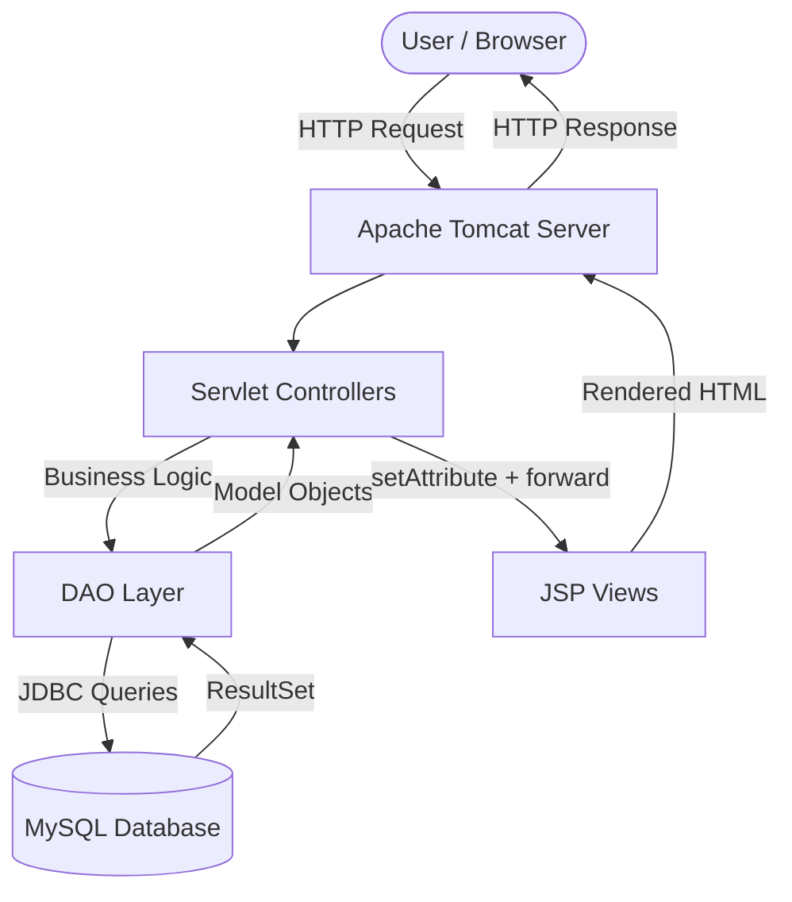

# Fashion Store — Project Report

---

## 1. Abstract

Fashion Store is a full-stack **e-commerce web application** built using Java technologies following the **MVC (Model-View-Controller)** design pattern. The application allows users to register, log in, browse fashion products across categories, search and filter products by category and price, view product details with size/color variants, manage a shopping cart, and place orders with shipping and payment details. The system uses **Jakarta Servlets** as controllers, **JSP (JavaServer Pages)** as the view layer, **JDBC** for database connectivity with **MySQL**, and is deployed on **Apache Tomcat**. The project demonstrates a real-world implementation of the **DAO (Data Access Object)** pattern to separate business logic from database operations.

---

## 2. Problem Statement

In today's digital era, customers expect to browse, compare, and purchase fashion products online without visiting physical stores. Small and medium fashion retailers often lack the technical infrastructure to offer this experience.

**The problem:** Build a web-based fashion e-commerce platform that provides:
- Secure user registration and authentication
- Product catalog with category-based filtering and price-based sorting
- Product variant management (size, color, stock)
- Shopping cart with add, remove, and quantity management
- Order placement with shipping address and payment method selection

The solution must follow industry-standard design patterns (MVC, DAO) to ensure maintainability, scalability, and separation of concerns.

---

## 3. Introduction

**Fashion Store** is a Java-based web application that simulates a real-world online shopping platform for fashion products. It is built entirely using the **Java EE (Jakarta EE)** ecosystem:

- **Backend:** Java Servlets handle all HTTP requests and business logic
- **Frontend:** JSP pages render dynamic HTML using data passed from servlets
- **Database:** MySQL stores all application data — users, products, carts, orders
- **Server:** Apache Tomcat serves the application as a WAR (Web Application Archive)
- **Build Tool:** Apache Maven manages dependencies and builds the project

The project is structured as a **3-tier application**:

```
┌─────────────────────────────┐
│   Presentation Tier (JSP)   │  ← What the user sees
├─────────────────────────────┤
│   Business Tier (Servlets)  │  ← Logic + request handling
├─────────────────────────────┤
│   Data Tier (DAO + MySQL)   │  ← Database operations
└─────────────────────────────┘
```

This project was developed as part of an internship to demonstrate proficiency in Java web development, understanding of design patterns, and the ability to build a production-ready web application from scratch.

---

## 4. Objectives

1. **User Management** — Implement secure registration and login with session-based authentication
2. **Product Catalog** — Display products with images, prices, brands, and descriptions
3. **Category System** — Organize products into categories (Men, Women, Footwear, Accessories, etc.) and allow filtering
4. **Search & Sort** — Allow users to search products by name and sort by price (low-to-high, high-to-low)
5. **Product Variants** — Support multiple size and color options per product with individual stock tracking
6. **Shopping Cart** — Let authenticated users add, view, and remove items from their cart
7. **Order Processing** — Allow users to place orders with shipping details and payment method
8. **MVC Architecture** — Follow the Model-View-Controller pattern for clean code separation
9. **DAO Pattern** — Use the Data Access Object pattern to abstract all database operations
10. **Responsive UI** — Create a visually appealing, responsive interface that works across devices

---

## 5. Advantages

1. **Clean Separation of Concerns** — Each layer (Controller, Model, DAO, View) has a single responsibility, making the codebase easy to understand and maintain
2. **Database Abstraction** — The DAO pattern means switching from MySQL to PostgreSQL or any other database only requires changing DAO implementations, not the controllers
3. **Reusable Components** — JSP partials (`navbar.jsp`, `footer.jsp`) are included across all pages — change once, reflected everywhere
4. **Session-Based Auth** — Server-side session management ensures users can't access protected pages without logging in
5. **Combined Filtering** — Category filter and price sort work together in a single request, providing a smooth user experience
6. **Product Variants** — Unlike simple e-commerce apps, this system supports real-world scenarios where a product has multiple size/color/stock combinations
7. **Scalable Architecture** — The DAO interface pattern allows adding new data sources or caching layers without touching existing code
8. **Standard Deployment** — Packaged as a WAR file, deployable to any Java servlet container (Tomcat, Jetty, WildFly)
9. **Maven Build** — Standardized build process — any developer can clone and run with `mvn package`
10. **No Framework Lock-in** — Built on pure Servlets and JSP (no Spring), which teaches fundamental concepts without abstraction

---

## 6. Disadvantages

1. **No Pagination** — All products load at once. For a catalog with 10,000+ products, this would be slow
2. **No Order History Page** — Users can place orders but cannot view their past orders
3. **No Admin Panel** — Products, categories, and orders can only be managed directly in the database — there's no admin interface
4. **Cart Not Persistent for Guests** — Guest users cannot add items to cart; they must register/login first
5. **No Image Upload** — Product images must be manually placed in the server's file system; there's no upload feature
6. **Single Payment Simulation** — Payment methods are selected but not actually processed (no payment gateway integration)
7. **No Stock Validation at Checkout** — The system doesn't verify if stock is still available when placing an order
8. **No Email Notifications** — Users don't receive confirmation emails after registration or order placement
9. **Verbose Code** — Pure Servlet/JSP requires more boilerplate compared to frameworks like Spring Boot
10. **No AJAX** — Every action causes a full page reload (form submissions, filter changes)

---

## 7. Future Scope

1. **Admin Dashboard** — A separate admin panel to add/edit/delete products, manage orders, and view analytics
2. **Order History** — A "My Orders" page where users can track their order status
3. **Payment Gateway** — Integrate Razorpay or Stripe for real online payments
4. **Pagination & Lazy Loading** — Load products in pages of 20 to improve performance
5. **Email Integration** — Send order confirmation and registration welcome emails using JavaMail API
6. **Image Upload** — Allow admins to upload product images through the web interface
7. **Wishlist Feature** — Let users save products they want to buy later
8. **Reviews & Ratings** — Allow users to review products and rate them
9. **Stock Management** — Deduct stock on order placement, show "Out of Stock" badges
10. **REST API** — Expose product/order data as JSON APIs for a potential mobile app frontend
11. **Spring Boot Migration** — Migrate the servlet-based app to Spring Boot for reduced boilerplate and modern tooling
12. **Docker Deployment** — Containerize the application for easy cloud deployment

---

## 8. What Has Been Achieved

### Core Features ✅
- [x] User registration with validation (duplicate email/phone checks)
- [x] User login with session creation
- [x] Session-based authentication guard on protected routes
- [x] Logout with session invalidation
- [x] Dynamic home page with latest 12 products and category cards from database
- [x] Product listing with search, category filter, and price sort (all working together)
- [x] Product detail page with size/color variants
- [x] Shopping cart — add, view, remove items, quantity auto-increment
- [x] Checkout page with pre-filled user details
- [x] Order placement with cart-to-order conversion and cart clearing
- [x] Order success confirmation page

### Architecture ✅
- [x] MVC pattern across all 12 servlets
- [x] DAO pattern with 8 interfaces and 8 implementations
- [x] 8 model classes mapping to 8 database tables
- [x] JSP view layer with reusable partials (navbar, footer)
- [x] Externalized database credentials (not hardcoded)
- [x] Maven-based build system

### UI/UX ✅
- [x] Custom CSS design system (Sage & Gold palette)
- [x] Responsive design for mobile/tablet/desktop
- [x] Micro-animations — card hover effects, staggered entrances, image zoom overlays
- [x] Glassmorphism navbar, custom scrollbar, gradient accents
- [x] Google Fonts integration (Cormorant Garamond + DM Sans)

---

## 9. System Design

### High-Level Architecture



### Request Lifecycle

Every user action in this application follows this exact flow:

```
1. User clicks a link or submits a form in the browser
2. Browser sends HTTP request to Tomcat (GET or POST)
3. Tomcat matches the URL pattern to a Servlet (@WebServlet annotation)
4. Servlet's doGet() or doPost() method is called
5. Servlet calls DAO methods to fetch/save data from MySQL
6. DAO returns Java model objects (POJOs)
7. Servlet sets model data as request attributes
8. Servlet forwards the request to a JSP page
9. JSP reads the attributes and generates HTML
10. Tomcat sends the HTML response to the browser
11. Browser renders the page
```

### Project Structure

```
fashion-store/
├── pom.xml                          ← Maven config (dependencies, build)
├── docs/                            ← This documentation
├── src/main/
│   ├── java/com/fashionstore/
│   │   ├── controller/              ← 12 Servlets
│   │   │   ├── LoginServlet.java
│   │   │   ├── RegisterServlet.java
│   │   │   ├── LogoutServlet.java
│   │   │   ├── HomeServlet.java
│   │   │   ├── ProductServlet.java
│   │   │   ├── ProductDetailsServlet.java
│   │   │   ├── AddToCartServlet.java
│   │   │   ├── CartServlet.java
│   │   │   ├── RemoveCartItemServlet.java
│   │   │   ├── CheckoutServlet.java
│   │   │   ├── PlaceOrderServlet.java
│   │   │   └── OrderSuccessServlet.java
│   │   ├── model/                   ← 8 POJO classes
│   │   │   ├── User.java
│   │   │   ├── Category.java
│   │   │   ├── Product.java
│   │   │   ├── ProductVariant.java
│   │   │   ├── Cart.java
│   │   │   ├── CartItem.java
│   │   │   ├── Order.java
│   │   │   └── OrderItem.java
│   │   ├── dao/                     ← 8 interfaces
│   │   │   ├── UserDAO.java
│   │   │   ├── CategoryDAO.java
│   │   │   ├── ProductDAO.java
│   │   │   ├── ProductVariantDAO.java
│   │   │   ├── CartDAO.java
│   │   │   ├── CartItemDAO.java
│   │   │   ├── OrderDAO.java
│   │   │   ├── OrderItemDAO.java
│   │   │   └── impl/               ← 8 implementations
│   │   │       ├── UserDAOImpl.java
│   │   │       ├── CategoryDAOImpl.java
│   │   │       ├── ProductDAOImpl.java
│   │   │       └── ... (8 files)
│   │   └── util/
│   │       ├── DBConnection.java    ← JDBC connection factory
│   │       └── AppInitializer.java  ← Loads DB creds from web.xml
│   └── webapp/
│       ├── index.jsp                ← Redirects to /login
│       ├── assets/css/              ← 7 CSS files
│       └── WEB-INF/
│           ├── web.xml              ← Deployment descriptor + DB creds
│           └── views/               ← 8 JSP pages
│               ├── login.jsp
│               ├── register.jsp
│               ├── home.jsp
│               ├── products.jsp
│               ├── product-details.jsp
│               ├── cart.jsp
│               ├── checkout.jsp
│               ├── order-success.jsp
│               └── partials/
│                   ├── navbar.jsp
│                   └── footer.jsp
```
