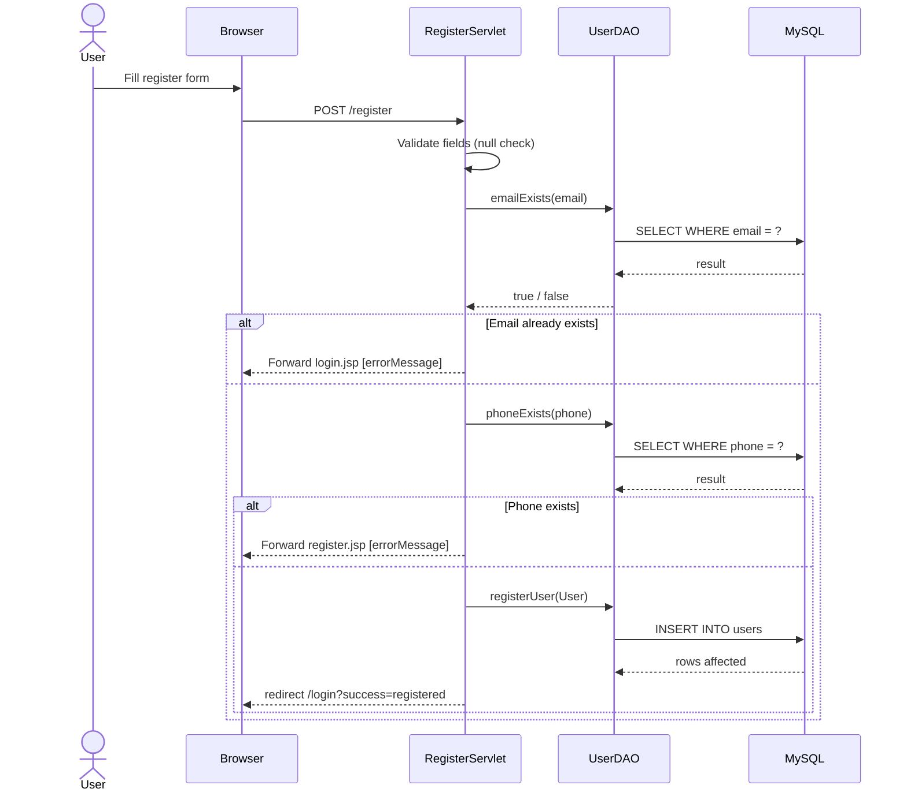
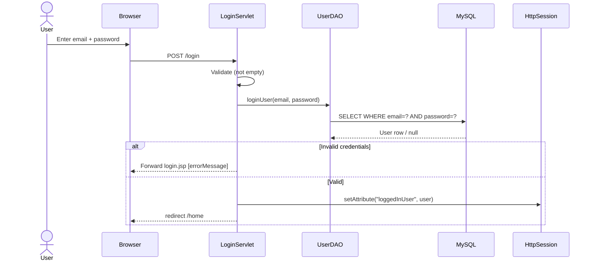
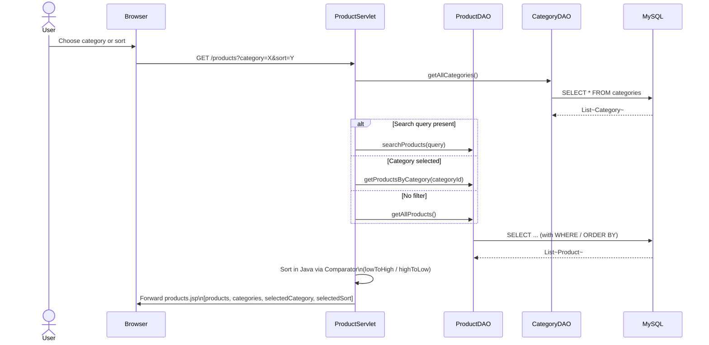
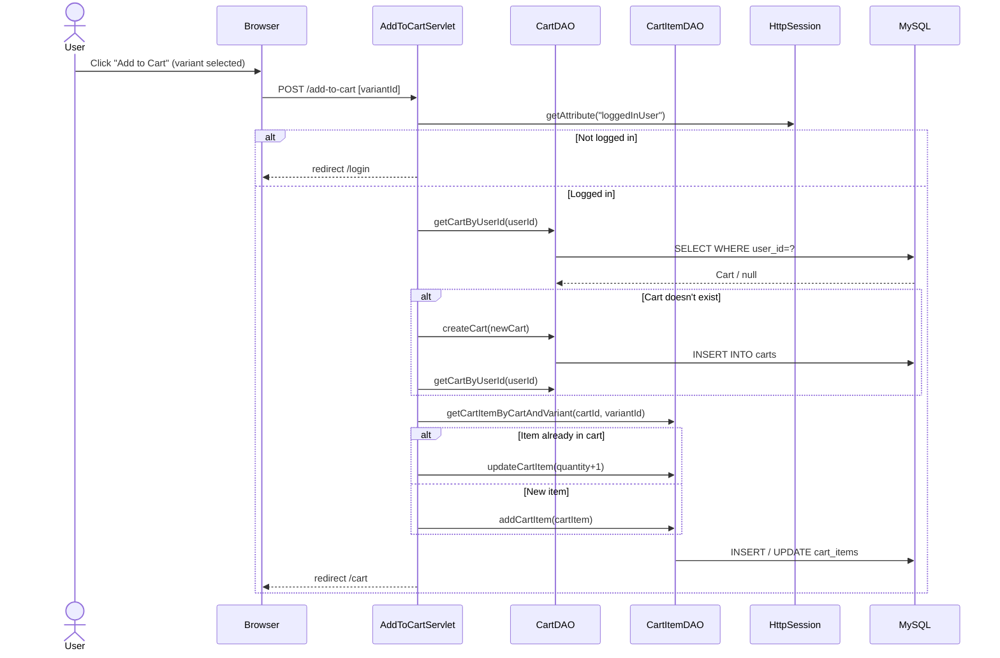
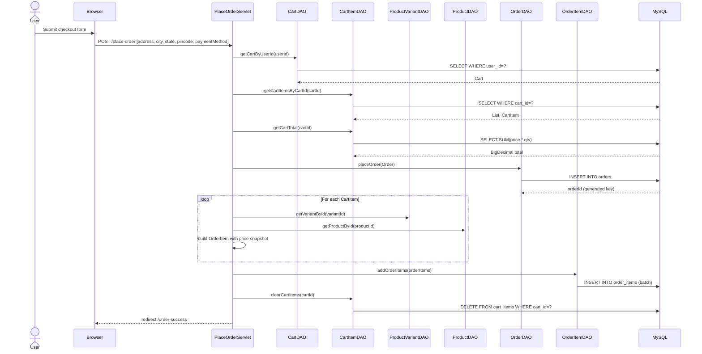

# Sequence Diagrams — Fashion Store

## 1. User Registration

```mermaid
sequenceDiagram
    actor User
    participant Browser
    participant RegisterServlet
    participant UserDAO
    participant DB as MySQL

    User->>Browser: Fill register form
    Browser->>RegisterServlet: POST /register
    RegisterServlet->>RegisterServlet: Validate fields (null check)
    RegisterServlet->>UserDAO: emailExists(email)
    UserDAO->>DB: SELECT WHERE email = ?
    DB-->>UserDAO: result
    UserDAO-->>RegisterServlet: true / false
    alt Email already exists
        RegisterServlet-->>Browser: Forward login.jsp [errorMessage]
    else
        RegisterServlet->>UserDAO: phoneExists(phone)
        UserDAO->>DB: SELECT WHERE phone = ?
        DB-->>UserDAO: result
        alt Phone exists
            RegisterServlet-->>Browser: Forward register.jsp [errorMessage]
        else
            RegisterServlet->>UserDAO: registerUser(User)
            UserDAO->>DB: INSERT INTO users
            DB-->>UserDAO: rows affected
            RegisterServlet-->>Browser: redirect /login?success=registered
        end
    end
```

---

## 2. User Login

```mermaid
sequenceDiagram
    actor User
    participant Browser
    participant LoginServlet
    participant UserDAO
    participant DB as MySQL
    participant Session as HttpSession

    User->>Browser: Enter email + password
    Browser->>LoginServlet: POST /login
    LoginServlet->>LoginServlet: Validate (not empty)
    LoginServlet->>UserDAO: loginUser(email, password)
    UserDAO->>DB: SELECT WHERE email=? AND password=?
    DB-->>UserDAO: User row / null
    alt Invalid credentials
        LoginServlet-->>Browser: Forward login.jsp [errorMessage]
    else Valid
        LoginServlet->>Session: setAttribute("loggedInUser", user)
        LoginServlet-->>Browser: redirect /home
    end
```

---

## 3. Browse & Filter Products

```mermaid
sequenceDiagram
    actor User
    participant Browser
    participant ProductServlet
    participant ProductDAO
    participant CategoryDAO
    participant DB as MySQL

    User->>Browser: Choose category or sort
    Browser->>ProductServlet: GET /products?category=X&sort=Y
    ProductServlet->>CategoryDAO: getAllCategories()
    CategoryDAO->>DB: SELECT * FROM categories
    DB-->>CategoryDAO: List~Category~

    alt Search query present
        ProductServlet->>ProductDAO: searchProducts(query)
    else Category selected
        ProductServlet->>ProductDAO: getProductsByCategory(categoryId)
    else No filter
        ProductServlet->>ProductDAO: getAllProducts()
    end

    ProductDAO->>DB: SELECT ... (with WHERE / ORDER BY)
    DB-->>ProductDAO: List~Product~

    ProductServlet->>ProductServlet: Sort in Java via Comparator\n(lowToHigh / highToLow)

    ProductServlet->>Browser: Forward products.jsp\n[products, categories, selectedCategory, selectedSort]
```

---

## 4. Add to Cart

```mermaid
sequenceDiagram
    actor User
    participant Browser
    participant AddToCartServlet
    participant CartDAO
    participant CartItemDAO
    participant Session as HttpSession
    participant DB as MySQL

    User->>Browser: Click "Add to Cart" (variant selected)
    Browser->>AddToCartServlet: POST /add-to-cart [variantId]
    AddToCartServlet->>Session: getAttribute("loggedInUser")
    alt Not logged in
        AddToCartServlet-->>Browser: redirect /login
    else Logged in
        AddToCartServlet->>CartDAO: getCartByUserId(userId)
        CartDAO->>DB: SELECT WHERE user_id=?
        DB-->>CartDAO: Cart / null
        alt Cart doesn't exist
            AddToCartServlet->>CartDAO: createCart(newCart)
            CartDAO->>DB: INSERT INTO carts
            AddToCartServlet->>CartDAO: getCartByUserId(userId)
        end
        AddToCartServlet->>CartItemDAO: getCartItemByCartAndVariant(cartId, variantId)
        alt Item already in cart
            AddToCartServlet->>CartItemDAO: updateCartItem(quantity+1)
        else New item
            AddToCartServlet->>CartItemDAO: addCartItem(cartItem)
        end
        CartItemDAO->>DB: INSERT / UPDATE cart_items
        AddToCartServlet-->>Browser: redirect /cart
    end
```

---

## 5. Place Order

```mermaid
sequenceDiagram
    actor User
    participant Browser
    participant PlaceOrderServlet
    participant CartDAO
    participant CartItemDAO
    participant ProductVariantDAO
    participant ProductDAO
    participant OrderDAO
    participant OrderItemDAO
    participant DB as MySQL

    User->>Browser: Submit checkout form
    Browser->>PlaceOrderServlet: POST /place-order [address, city, state, pincode, paymentMethod]

    PlaceOrderServlet->>CartDAO: getCartByUserId(userId)
    CartDAO->>DB: SELECT WHERE user_id=?
    DB-->>CartDAO: Cart

    PlaceOrderServlet->>CartItemDAO: getCartItemsByCartId(cartId)
    CartItemDAO->>DB: SELECT WHERE cart_id=?
    DB-->>CartItemDAO: List~CartItem~

    PlaceOrderServlet->>CartItemDAO: getCartTotal(cartId)
    CartItemDAO->>DB: SELECT SUM(price * qty)
    DB-->>CartItemDAO: BigDecimal total

    PlaceOrderServlet->>OrderDAO: placeOrder(Order)
    OrderDAO->>DB: INSERT INTO orders
    DB-->>OrderDAO: orderId (generated key)

    loop For each CartItem
        PlaceOrderServlet->>ProductVariantDAO: getVariantById(variantId)
        PlaceOrderServlet->>ProductDAO: getProductById(productId)
        PlaceOrderServlet->>PlaceOrderServlet: build OrderItem with price snapshot
    end

    PlaceOrderServlet->>OrderItemDAO: addOrderItems(orderItems)
    OrderItemDAO->>DB: INSERT INTO order_items (batch)

    PlaceOrderServlet->>CartItemDAO: clearCartItems(cartId)
    CartItemDAO->>DB: DELETE FROM cart_items WHERE cart_id=?

    PlaceOrderServlet-->>Browser: redirect /order-success
```
